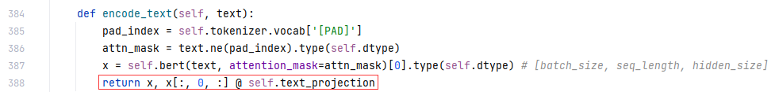

# HARNN
Mentioned of the part of **HARNN** model, we use the implementation of https://github.com/electron1c/HARNN-pytorch.

Details can be seen by visiting the previous link.

# CN-Clip

As for the CN-Clip part, we use the library provided by https://github.com/OFA-Sys/Chinese-CLIP. And install it using pip.

We only use the CN-Clip model to retrieve feature vectors of texts and images to feed to HARNN.

Some changes have been made to CN-Clip, as follows.

First find the method CLIP.encode_text(), and make changes to it in order to return the text features(not the global features).

